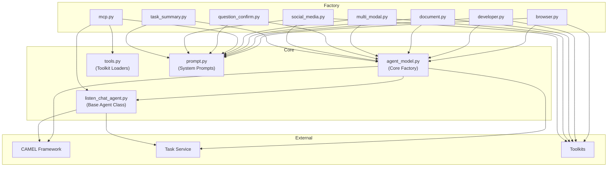

# Agent Module

This module provides the agent infrastructure for paxs super agent, built on top of the CAMEL and Eigent framework.

## Architecture Overview

## File Descriptions

| File                   | Purpose                                                              |
| ---------------------- | -------------------------------------------------------------------- |
| `agent_model.py`       | Core factory function for creating agents with event loop management |
| `listen_chat_agent.py` | Base agent class extending CAMEL's ChatAgent with task tracking      |
| `tools.py`             | Toolkit and MCP tools loader utilities                               |
| `prompt.py`            | System prompts for all 8 agent types                                 |

### Factory Files

| File                  | Agent Type                  |
| --------------------- | --------------------------- |
| `browser.py`          | Senior Research Analyst     |
| `developer.py`        | Lead Software Engineer      |
| `document.py`         | Documentation Specialist    |
| `multi_modal.py`      | Creative Content Specialist |
| `mcp.py`              | MCP Server Agent            |
| `question_confirm.py` | Question Confirmation       |
| `social_media.py`     | Social Media Manager        |
| `task_summary.py`     | Task Summarizer             |
